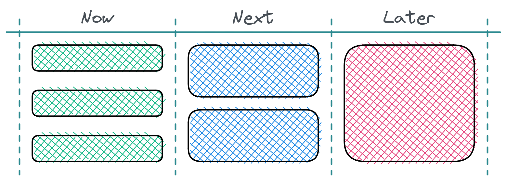

If you're a Product Manager, you've likely had requests to display your roadmap as a Gantt chart and forecast delivery dates. These requests will come from managers and stakeholders who wish to track the planned outputs against deadlines or due to legacy Project Management Office behaviours.

Regardless of the catalysts, these requests come from good intentions. However, your organisation will likely be too focused on shipping features and meeting arbitrary timescales to satisfy customer wants instead of solving real problems. If this sounds familiar, I recommend reading Escaping the Build Trap by Melissa Perri. This approach will likely focus on delivering features that do not meet expectations, causing dissatisfaction for customers and stakeholders.

Instead, I prefer a[ theme-based roadmap](https://www.prodpad.com/blog/how-to-build-a-product-roadmap-everyone-understands/). This roadmap style requires you to focus on customer problems we intend to solve, experiments you want to run, and the R&D for longer-term strategic bets.

>    Themes are a Promise to Solve Problems, Not Build Features.
>
>    [Jared M. Spool](https://articles.uie.com/themes/)

You then arrange these themes across different time horizons covering the Present, Near Term and Future. They're usually labelled as Now, Next and Later. Items closer to the present will be smaller, better-understood items with more explicit scope, just like your product backlog. These time horizons are the real differentiator - as traditional roadmaps list promised features arranged across a timeline with pre-agreed specifications and delivery dates.

Using a theme-based roadmap allows you to reprioritise themes based on customer needs while discovering how to realise the product vision.

### So how does a theme-based roadmap work?

Much like a backlog of user stories, you'll prioritise the opportunities and problems. Next, you'll arrange these themes over three or four columns. From left to right, they'll read Now, Next and Later. Once complete, you'll have produced something which resembles an agile board.

Items in Now are well-understood problems with clear deliverables and fixed scope. As you move further to the right-hand side, you'll find items with more ambiguity. The Later column on my roadmap contains fluffy titles for candidate projects requiring discovery. I am currently using Now, Next, Later and Ideas. The Ideas column is a backlog for problems and new ideas to replenish our Later column periodically.

However, you can adjust the labels for each time horizon to best convene the current and future work. For example, renaming Later to read H2 2021 is helpful while retraining those used to traditional timelines.

### So what's it like using a theme-based roadmap?

After using this framework for the last couple of years, I learnt through experience that arranging initiatives modifies everyone's mindset when discussing our roadmap during our[ Product Council](https://svpg.com/the-product-council/) meetings. Instead of discussing the delivery of a single feature, we have conversations about our customer's problems and goals. In addition, as we release each new iteration, we collect further feedback to confirm how well we solved the problem. Our roadmap has become the communication tool that facilitates these discussions.

Meeting and discussing the roadmap in this manner has forced us to prioritise these problems carefully. In turn, we've focused on the right opportunities and delighted our customers as we solve their challenges. I hope you find the above interesting and try out the format for your product.
