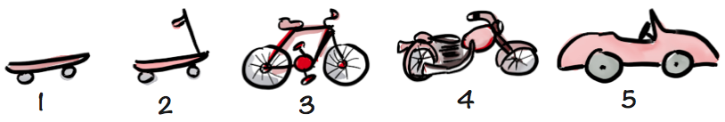
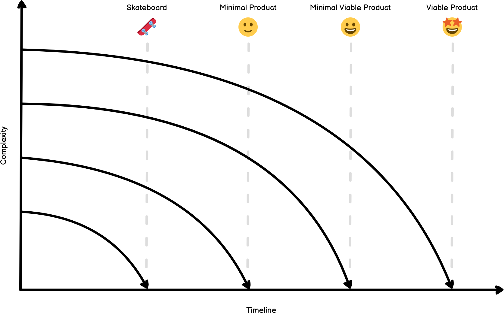

If you've worked in a software team, you'll have heard the term Minimal Viable Product and everyday vocabulary. Unfortunately, in my experience, the idea of an MVP is frequently misunderstood and abused to deliver a project within a time box. After which, the product development team would pivot to another project. Not before making some very minor changes based on user feedback.

Unsurprisingly, this practice produced disappointing software and frustrated customers. Therefore, an MVP has to be more than just minimal functionality to delight our customers. Ideally, after the initial release, sustained development would satisfy all the desired outcomes and polish experiences that didn't perform as expected.

>    However we choose to make an MVP, we need to make it meaningful.
>
>    <cite>[Brian Pagán](https://brianpagan.net/2015/lean-startup-mvp-how-to-make-meaningful-products/)</cite>

Sadly, these behaviours stem from utilising an internal technology team as an onsite software agency. Furthermore, I suspect this comes from an I.T. project mentality to procure customer solutions for the current operational problems.

These behaviours are the antithesis of modern software development and prevent organisations from becoming product companies. But through transparency, careful management of expectations, and autonomy, a product development team will deliver a valuable, usable, and feasible product.

While the metaphors present in Henrik Kniberg's article "[Making sense of MVP (Minimum Viable Product) – and why I prefer Earliest Testable/Usable/Lovable](https://blog.crisp.se/2016/01/25/henrikkniberg/making-sense-of-mvp)" are perhaps a little confusing. If you intended to build a car, you'd start with a simple automobile.

But, the concept does highlight the need for deliberate iterations and pragmatism, which evolves the software complexity to delight customers.

To get you off to a good start, you should be able to articulate the following clearly to find your MVP:

1. Who will use your product?
2. What is the problem you're solving?
3. What value does your product create? For example, redefine an existing industry, time savings or financial returns.
4. Is it feasible, and when can it be delivered?
5. How will the product be monetised, subscriptions or advertising?
6. Out of all the validated ideas, what is the core functionality?

In Kniberg's article, the "skateboard release" is a crucial point and the first production release. Getting to this point is a big triumph and something to celebrate. But your initial version is where the real work starts. It's the point where we are collecting quantitive data from usage and qualitative feedback from customers under production conditions. That's the point of the MVP. Build enough to learn and improve. It will be emotional as we understand whether our initial version is valuable and usable. However, armed with this new information, we can start the journey of continuous discovery and iteration.

Therefore, Kniberg recommends considering this initial release as your Earliest Testable Product. To that end, Product Managers should modify our language to suit the audience and carefully convey this point to suit the audience. Highlighting it will take successive versions to produce the Earliest Loved Product.

It’s tricky, as most don't understand the Minimum Viable Product concept. Depending upon the audience, saying prototype may be divisive or confusing. I usually choose to describe the collection of features as an initial solution. I do this to prepare users and stakeholders to expect further change to accomplish the desired outcomes, as the initial version is an opportunity to learn.

As the product development team includes ideas postponed from the skateboard release; you'll edge closer to the desired MVP and, later, a Viable Product. With each learning cycle, we can adapt the solution to meet the market's changing needs and delight our customers. The following diagram tweeted by Jussi Pasanen epitomises the anatomy of a great MVP.

https://twitter.com/jopas/status/515301088660959233

I like this diagram because it highlights how our products must be reliable and well-designed to provide customers with a valuable solution.

I hope the above was helpful. To close out this short essay, I'd like to leave you with a few closing thoughts which might help you in future.

1. Use the acronym MVP sparingly, as it's a loaded term, and be upfront with everyone about the scope.
2. To help articulate the vision, try writing out the validated ideas as desired Outcomes or ORKs. These techniques will give further structure and allow you to easily translate them into Epics and Stories.
3. Prioritise your Stories carefully to be lean. It may seem obvious, but prioritising the wrong items can be expensive. To avoid this common pitfall, try using the User Story Mapping technique to help confirm priorities to achieve the desired outcome and avoid confirmation bias.
4. Find a noun appropriate for your organisation to best label the initial release. For example, Skateboard may work for you. But depending on the audience, I use "prototype" or simply point out that this version is our initial release.
5. Try to be unemotional about your work and earnest that the feedback is welcome and valuable. Continuous discovery is crucial to ongoing innovation and success.
6. Finally, attempt to quickly release minor changes discovered through customer feedback after the initial release. Doing so will generate a lot of goodwill for internal products.
