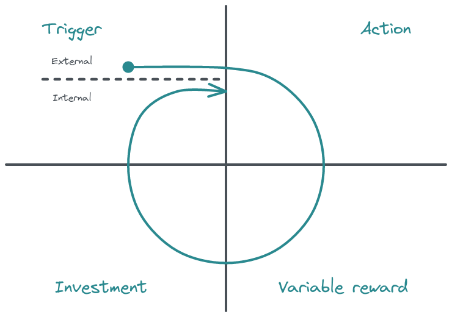

To continue the theme of trying to open up Product Management to a broader audience, I thought it worth exploring why I believe collaboration, empathy, and honesty are the hallmarks of organisations that create products with highly engaged users.

From my vantage, Product Management is a misunderstood social discipline requiring us to appreciate the interpersonal skills necessary to cultivate relationships and actively listen to Stakeholders and Customers with empathy in the interest of learning from them. Additionally, our market knowledge will grow, allowing us to discuss those apparent opportunities with our Design and Engineering colleagues for further investigation.

Some conversations will be challenging, and Product Managers must keep their [biases](https://mobile.twitter.com/theevabea/status/1605252972753129472) in check to ensure we hear the opinions of our Customers and Stakeholders. Otherwise, our thinking has built-in prejudices that will stop us from learning about their situation. Articles such as [Leading without being the Boss by Roman Pichler](https://mobile.twitter.com/theevabea/status/1605252972753129472) are helpful because they reinforce how attentiveness, curiosity, openness, and integrity make for effective [servant leadership](https://en.wikipedia.org/wiki/Servant_leadership).

It will be challenging. Company leadership and the Sales team will push us to "Build first, ask questions later", as their remuneration might depend upon a particular improvement. In a Product-led organisation, everyone should lean in and share their point of view to benefit customers. That requires all parties to collaborate, avoid conflict, and achieve alignment that serves the customer while remaining focused on our shared [Mission, Vision, and Strategy](https://www.lennysnewsletter.com/p/mission-vision-strategy-goals-roadmap).

Increasingly, I view Sales and Customer Success as an extension to the core Product team—an intelligence network allowing us to draw on the broadest insight as they're speaking to customers more regularly than anyone from the Product team. As a result, you're more likely to be aware of changes in the market sooner, and various unmet customer needs they're confident we can fulfil. But, as Gabrielle says below, it's our job, Product Managers, to work with Sales.

https://twitter.com/gbufremsays/status/1605973420864180227

If we're all working in concert, we can get under the skin of the problems that matter. We can then move forward and explore how we'll solve them. That requires a two-way conversation with both disciplines sharing crucial information to develop a shared understanding and begin the journey to a [Product-led organisation](https://www.pendo.io/product-led/). Additionally, it will need collaboration with the customer to support further problem discovery and confirmation. It is challenging, but we need to cut through this cacophony of noise to extract the necessary information to solve the problems that resonate with our users. The objective must be to create a delightful experience and ethical triggers that drive our users' regular usage.

Lastly, if we identify what's truly important to our customers, we'll see the results in our data. Once internalised after that initial 'Aha' moment, a mental trigger will prompt users to return repeatedly—for example, checking their daily sales revenue attributed to their advertising, promotions and subscription strategies. We should then be able to monitor feature adoption via product dashboards highlighting Weekly Active Users, Monthly Active Users and changes to Annual Recurring Revenue. If you want to learn more, I highly recommend reading [Hooked by Nir Eyal](https://amzn.to/3YIql7J) to explore how you may build habit-forming products and [The Hooked Model](https://www.nirandfar.com/how-to-manufacture-desire/) above diagram.

I hope the above was insightful and that you'll consider sharing your perspective with a Product Manager in your company over a cup of coffee.
